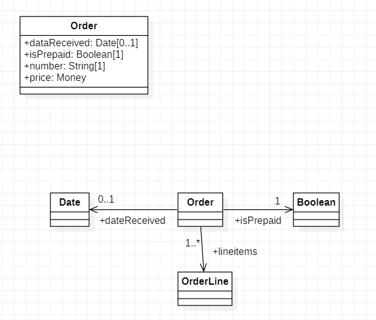
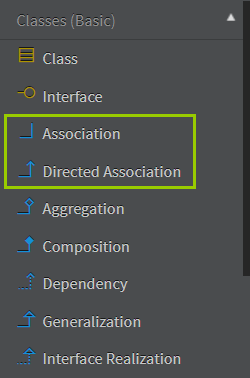
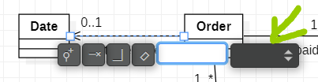
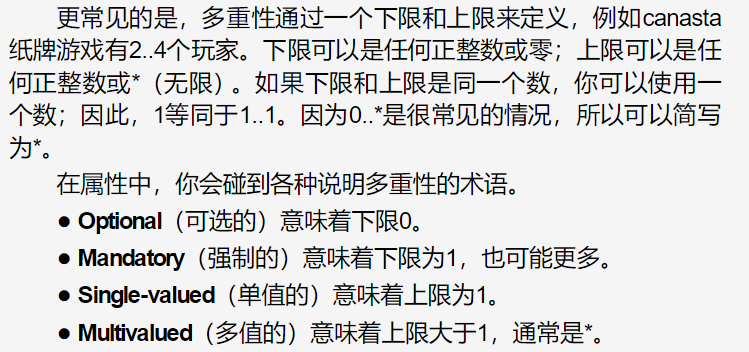
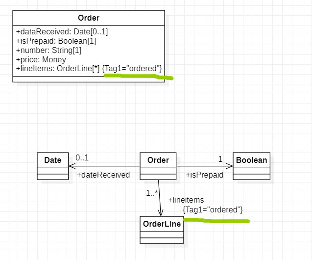
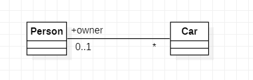

类图(class diagram)描述系统中的对象类型，以及存在于它们之间的各种静态关系。

类图也展示类的**性质(property)和操作(operation)**，以及应用于对象连接方式的约束。


# 性质

性质(property)代表类的结构特性。一开始，可以把性质粗略看作对应于类中的**字段**。


性质可以以两种十分不同的表示法出现：**属性和关联。**


## 属性

**属性(attribute)**表示法把**性质**描述成类方框中的一行文本。

属性的完整形式如下：

```c++
visibility name: type multiplicity = default {property_string}
```


只有name是必需的。

visibility标记意味着属性是公开的(+)还是私有的(-)。

default value是在创建期间没有指定值时新创建对象的值。

multiplicity会在后续介绍。

{property-string}允许你指出属性附加的性质。{readOnly}来表示客户不可以修改该性质。


## 关联

**关联(association)**是一根两个类之间的实线，方向从源类到目标类。

性质的名称以及多重性放在关联的目标端。**关联的目标端链接到性质所属类型的类。**




两种表示方法。


比如0..1和+dateReceived链接到目标端的Date。



关联和有向关联。



点击线，可以显示多重性，注意，要点击相应的线。


倾向于对小的东西使用属性，例如日期或者布尔-值类型。

对于更重要的类，使用关联，例如顾客和订单。


# 多重性

性质的**多重性(multiplicity)**指出多少对象可以填充该性质。


最常见的多重性是：

1(一张订单必须有且只有一名顾客。)

0..1(一名企业顾客可能有一名销售代表，也可能没有销售代表。)

*(一名顾客不需要下订单，但是顾客下的订单数量没有上限-零或者更多张订单。)



如果有一个多值的性质，可以使用复数形式来命名。




默认地，多值多重性的元素**形成了一个集合。**

如果向一名顾客要他的订单，返回订单的顺序是不固定的。

如果订单的排序在关联中有含义，需要添加{ordered}到关联端。如果允许重复，添加{nonunique}。

默认值是{unordered}和{unique}，可以显式写出来。

也有面向集合的名称，**例如{bag}的意思是无序、非唯一。**


属性的默认多重性是[1]，虽然元模型允许，但是图中如果有属性没有标出多重性，

不能假设多重性为[1]。


# 双向关联




双向关联是一对性质，它们从两个方向链接在一起。Car类有性质owner: Person[0..1]，Person类有性质cars: Car[*]。

也就是Person有多个Car，而Car有一个主人或者没有主人。


//76


